# 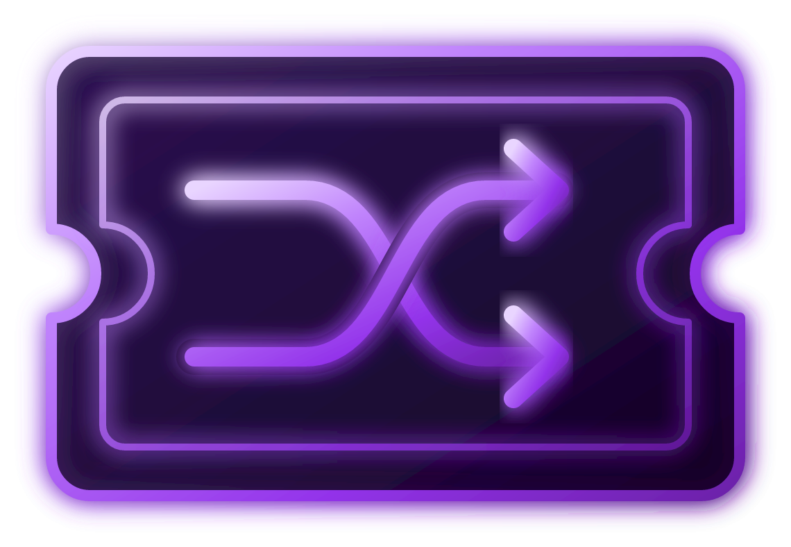 Autismo Cinema

Catálogo de filmes do grupo: várias **listas** (uma pra cada contexto — com os amigos, com
a família, sozinho etc.), cada uma com seus próprios filmes e quem já assistiu o quê, e
uma **roleta** 🎡 pra ajudar a decidir o que ver quando ninguém consegue escolher (ou seja,
sempre).

Não existe cura pra bagunça de um grupo decidindo o que assistir às 23h de domingo — mas
dá pra organizar um pouco. Não tem servidor/banco de dados — é um app 100% client-side:
tudo (login, listas, filmes, avaliações, preferências) fica salvo no `localStorage` do
navegador. Os dados de catálogo dos filmes (pôster, sinopse, elenco, nota) vêm da API do
TMDB (com OMDB como complemento/alternativa), buscados uma vez ao cadastrar/editar um
filme.

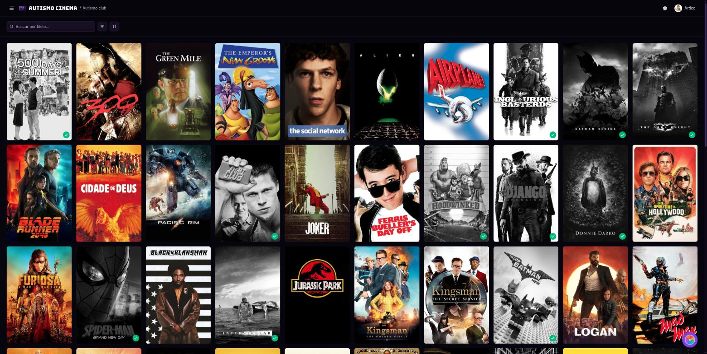

## Principais funcionalidades

- 🔐 **Login/registro** próprio (sem serviço externo) — senha com hash+salt (PBKDF2), sessão
  com expiração deslizante.
- 📋 **Múltiplas listas** de filmes, cada uma podendo ser reordenada (drag and drop), renomeada
  e excluída — uma pra cada "panelinha" do grupo.
- 🔎 **Cadastro de filme** via busca no TMDB (poster, sinopse, elenco, direção, nota IMDb,
  onde assistir) ou manual, com detecção de duplicados (porque alguém sempre tenta
  cadastrar o mesmo filme duas vezes).
- ✅ **Marcar como assistido** (e desfazer, sem apagar histórico — ninguém precisa saber
  que você reassistiu pela quinta vez).
- 🎡 **Roleta**: sorteia um filme entre os ainda não assistidos (com filtros avançados e
  inclusão manual de filmes específicos), com animação de giro — resolve a maior briga da
  noite em segundos.
- 🖱️ **Seleção em massa**: marcar vários filmes como assistido/não assistido, copiar pra
  outra lista ou excluir de uma vez.
- 🎚️ **Filtros e ordenação** avançados (gênero, ano, nota, elenco, plataforma etc.).
- 💾 **Backup**: exportar (arquivo ou área de transferência, com opção de escolher quais
  listas) e importar (arquivo ou colado, com validação e opção de mesclar ou sobrescrever)
  todo o acervo — filmes, listas, pessoas, avaliações e preferências. Nunca inclui
  login/senha.
- ⚙️ **Preferências**: tamanho da grade de pôsteres e nível de animação (desativado, básico,
  completo — o completo tem efeitos de hover/3D que só fazem sentido com mouse).
- ✨ Tela de login com um mural de pôsteres animado (desktop e mobile) e uma pequena
  animação de entrada.

<table>
<tr>
<td>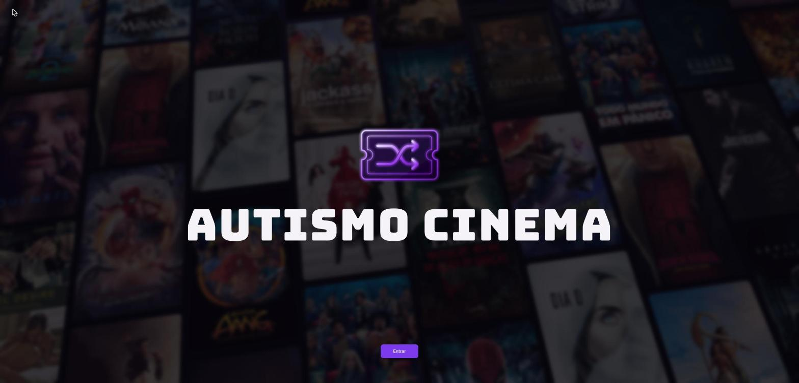</td>
<td>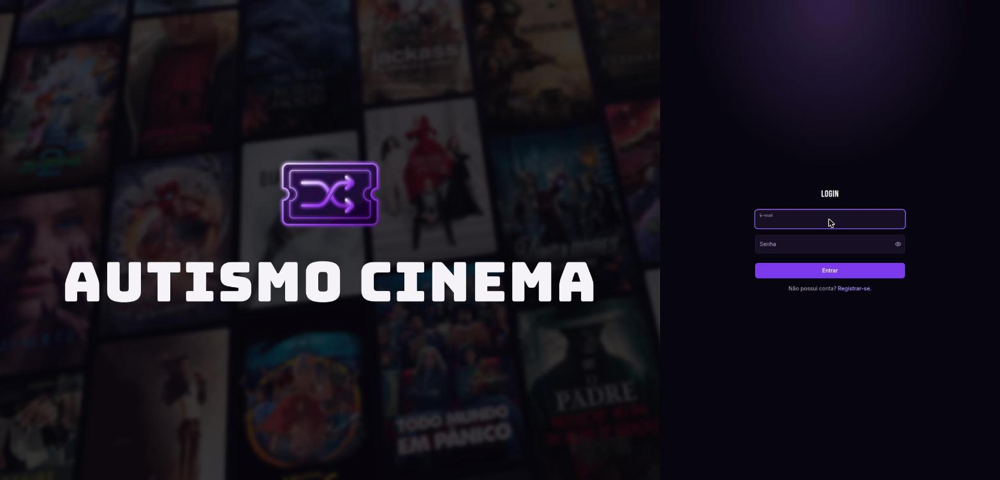</td>
</tr>
</table>

### Detalhes de um filme

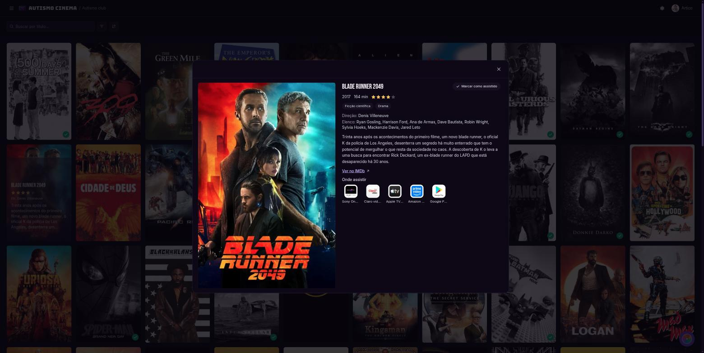

### Roleta

<table>
<tr>
<td>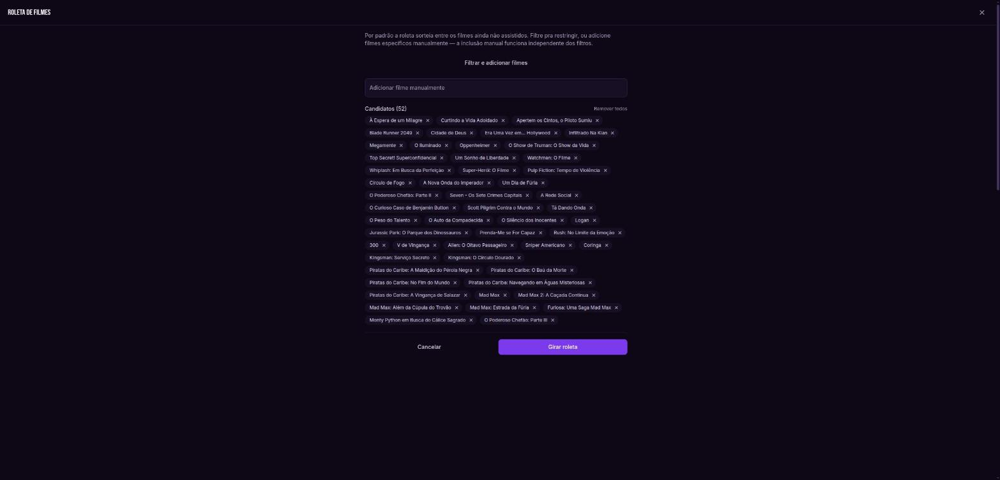</td>
<td>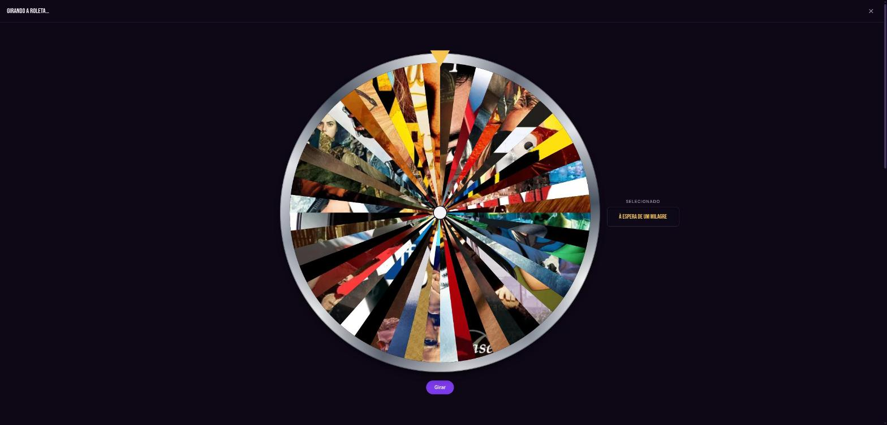</td>
<td>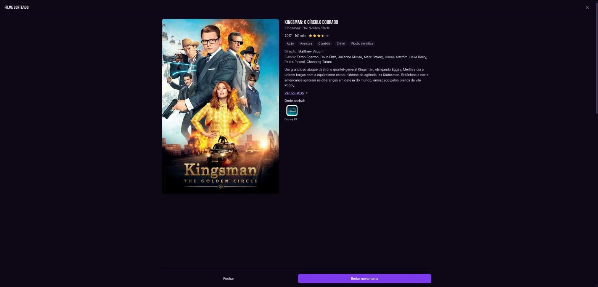</td>
</tr>
</table>

### Listas e configurações

<table>
<tr>
<td>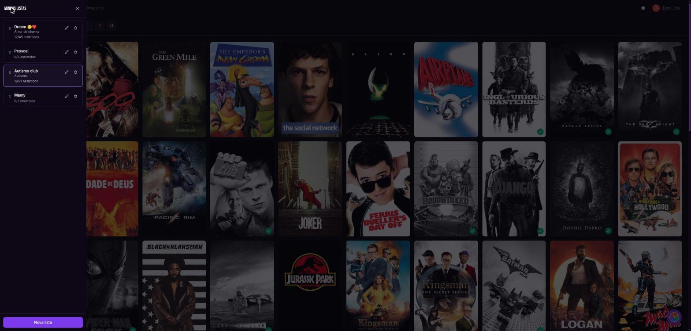</td>
<td>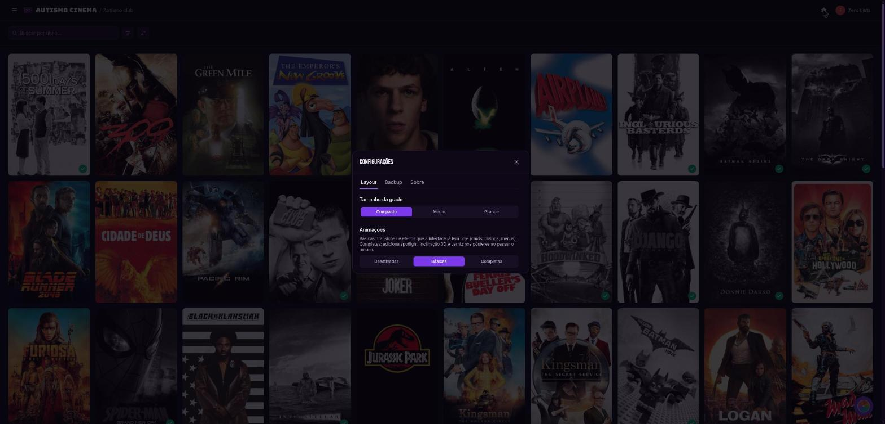</td>
<td>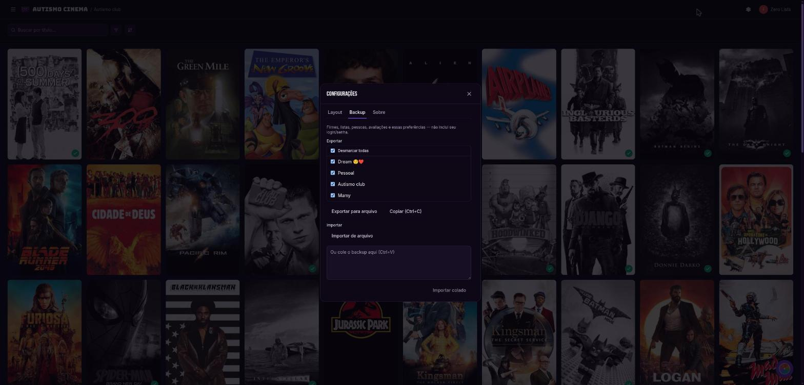</td>
</tr>
</table>

### 📱 No celular

Porque o grupo decide o que assistir de qualquer lugar — inclusive no sofá, sem vontade
nenhuma de abrir o notebook:

<table>
<tr>
<td>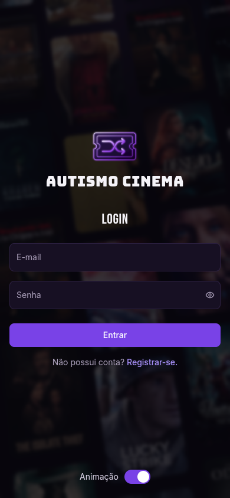</td>
<td>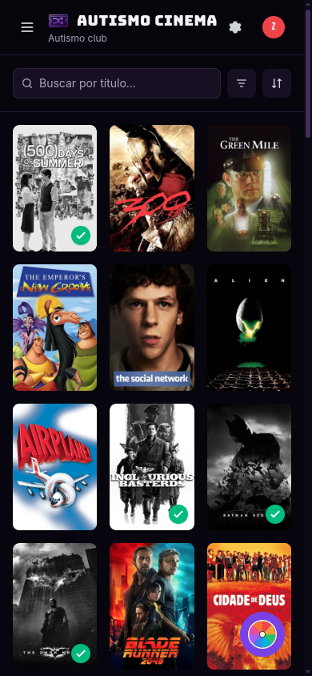</td>
<td>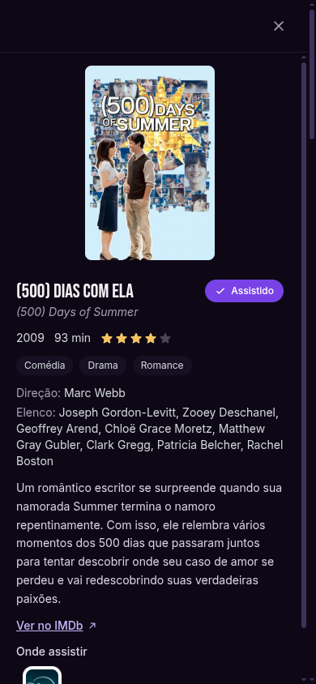</td>
<td>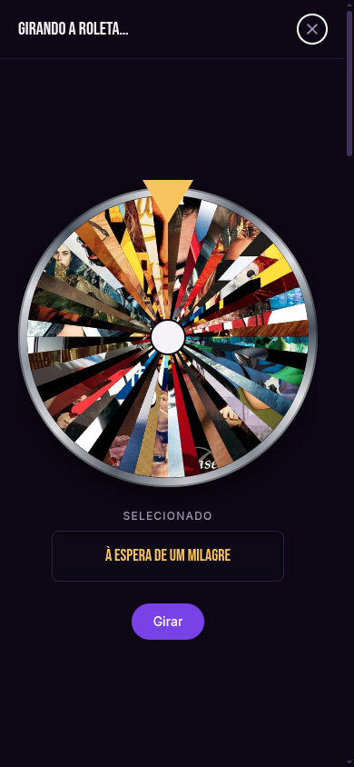</td>
</tr>
</table>

## 🛠️ Stack técnica

- [React Router](https://reactrouter.com/) v8 em modo framework (SSR + roteamento)
- React 19 + TypeScript
- [Tailwind CSS v4](https://tailwindcss.com/) (config via CSS, sem `tailwind.config.js`)
- [GSAP](https://gsap.com/) (drag/inércia) para a roleta; o resto das animações é CSS
- Vite como bundler/dev server
- Sem banco de dados — persistência é só `localStorage` (ver `app/storage/`)
- TMDB API (principal) e OMDB API (complemento) pra dados de catálogo dos filmes

## 🚀 Como rodar o projeto

### Pré-requisitos

- Node.js e npm
- Uma conta no [TMDB](https://www.themoviedb.org/settings/api) (grátis) pra gerar um
  Access Token e uma API Key. Opcionalmente, uma API key do [OMDB](https://www.omdbapi.com/apikey.aspx).

### Instalação

```bash
npm install
```

Copie `.env.example` pra `.env` e preencha as chaves:

```bash
cp .env.example .env
```

```
VITE_TMDB_ACCESS_TOKEN=
VITE_TMDB_API_KEY=
VITE_OMDB_API_KEY=
```

Sem essas chaves o app ainda roda, mas a busca de filmes por título (TMDB/OMDB) e o mural
de pôsteres da tela de login não funcionam.

### Rodando em desenvolvimento

```bash
npm run dev
```

Abre em `http://localhost:5173`, com hot reload.

### Outros comandos

```bash
npm run typecheck   # gera os tipos de rota do React Router e roda o tsc
npm run build       # build de produção (build/client + build/server)
npm run start       # serve o build de produção (build/client) na porta 3000
```

## Estrutura do projeto

```
app/
├── api/            # Clientes TMDB/OMDB e o "movieProvider" que escolhe entre eles
├── components/     # Componentes de UI reutilizáveis (common, filters, layout, movies, roulette, auth)
├── contexts/       # AuthContext (usuário logado) e ToastContext (avisos)
├── dialogs/        # Modais de cada fluxo (cadastrar/editar filme, roleta, configurações, listas, perfil...)
├── hooks/          # useMovies, useLists, useSettings, useMovieFilters, useMovieSort etc.
├── models/         # Tipos de domínio (Movie, MovieList, Person, Rating, AppSettings, AppUser...)
├── routes/         # As 3 rotas do app: index (redireciona), login, filmes
├── services/       # authService (registro/login/hash de senha/sessão)
├── storage/        # storageService (wrapper do localStorage), um repositório por entidade, e backup.ts
└── utils/          # Funções puras (validação, filtros, ordenação, duplicados de filme)
```

Cada entidade (filmes, listas, pessoas, avaliações, configurações, usuários, sessão) tem
seu próprio "repository" em `app/storage/repositories/` — uma camada fininha sobre
`localStorage` com `getAll`/`add`/`update`/`remove` (e `reorder`/`replaceAll` onde faz
sentido). Os hooks em `app/hooks/` só expõem esses repositórios como estado do React.

## Editando o projeto

- **Adicionar um campo num modelo**: edite o tipo em `app/models/`, ajuste o repositório
  correspondente se precisar de alguma migração leve (veja `settingsRepository.ts` pra um
  exemplo de migração de um campo antigo), e ajuste `app/storage/backup.ts` se o campo
  precisa ser validado/exportado no backup.
- **Adicionar uma tela/diálogo novo**: siga o padrão de `app/dialogs/*.tsx` — recebem
  `open`/`onClose` e o estado relevante via props, sem router próprio (são só overlays
  sobre a rota `filmes`).
- **Estilos**: Tailwind v4, tema (cores `ink-*`/`brand-*`/`mist-*`, fontes) definido em
  `app/app.css` via `@theme`. Não existe `tailwind.config.js`.
- **Sem testes automatizados** configurados — validar mudanças rodando `npm run dev` e
  conferindo manualmente, mais `npm run typecheck`.

## Deploy

O app builda como um servidor Node comum (`@react-router/serve`-style), então qualquer
plataforma que rode Node serve:

```bash
npm run build
npm run start
```

Ou via Docker, se preferir:

```bash
docker build -t autismo-cinema .
docker run -p 3000:3000 autismo-cinema
```

Lembre de configurar as variáveis de ambiente (`VITE_TMDB_ACCESS_TOKEN`,
`VITE_TMDB_API_KEY`, `VITE_OMDB_API_KEY`) — elas são lidas em **build time** (prefixo
`VITE_`), então precisam estar disponíveis quando `npm run build` roda, não só em runtime.

## 🚧 Planejado

A especificação original (`docs/PLANO.md`) previa mais coisa do que o que está construído
até agora — como toda promessa de fim de semana, algumas coisas ficaram pro próximo
sprint (que também não tem data). O que falta:

- **Pessoas do grupo e avaliação individual.** Os modelos (`Person`, `Rating`) e os
  repositórios já existem e já entram no backup, mas não há nenhuma tela pra isso ainda:
  falta o cadastro de pessoas, o dialog "quem está avaliando / nota / comentário", e exibir
  no detalhe do filme a média do grupo + avaliações/comentários individuais ao lado da nota
  do IMDb. Esse é o maior gap em relação ao plano original.
- **Mais GSAP no desktop.** Hoje o GSAP só é usado na roleta (arrastar/girar + fogos).
  Entrada dos cards, hover do pôster, abertura de dialogs e troca de filtros usam apenas
  transições CSS — funcionam, mas o plano original previa GSAP nesses pontos também.

---

Como não há banco de dados, todo o acervo do grupo vive no `localStorage` do navegador de
cada pessoa — use a aba **Backup** nas Configurações pra exportar/importar e manter todo
mundo sincronizado. Combinado é combinado: faça backup antes de sobrescrever tudo. 🍿
